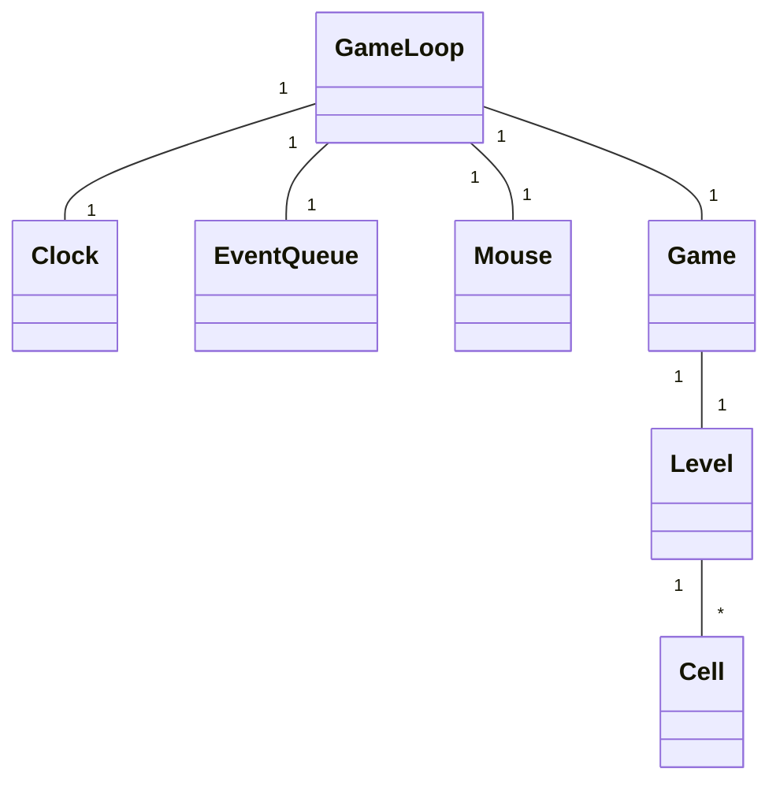
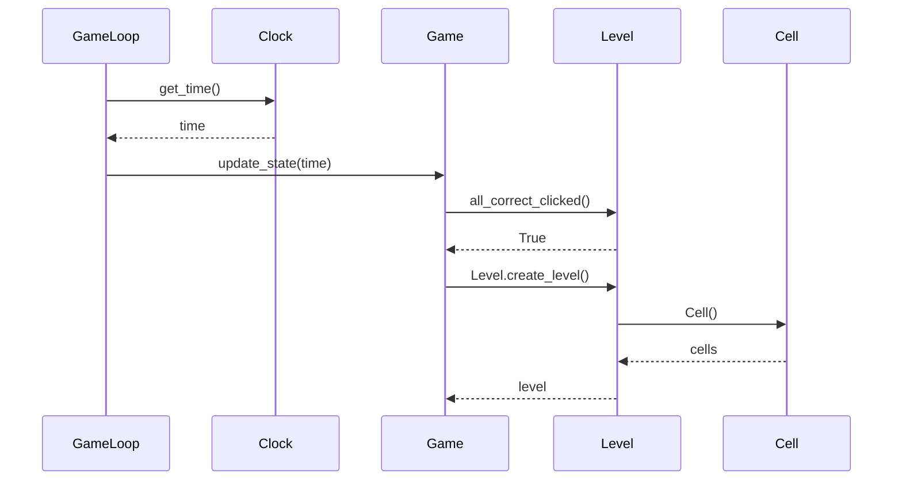
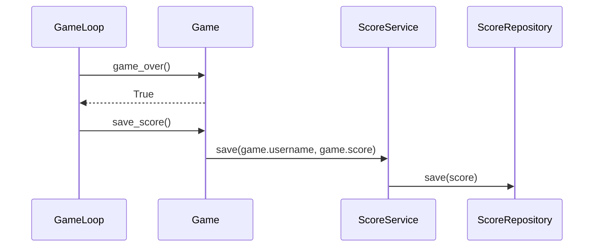

# Arkkitehtuuri

## Rakenne
Ohjelman pakkausrakenne on seuraavanlainen:  
  

__Services__-pakkauksen __game__-pakkaus sisältää pelilogiikan. __Database__-pakkaus vastaa tietokantaoperaation rajapinnasta muille luokille, ja __repositories__-pakkaus vastaa itse tietokantaoperaatioista. __UI__:ssa olevat luokat vastaavat pelin ja menujen piirtämisestä. Pakkaus __sprites__ sisältää piirrettävät objektit.

## Sovelluslogiikka

Pelin logiikka pohjautuu GameLoop-luokkaan, joka päivittää pelin tilannetta jatkuvasti. GameLoopin suhdetta muihin luokkiin kuvaa seuraava luokkakaavio:

### Luokkakaavio

Game-luokka huolehtii meta-tason pelilogiikasta, joka ei liity yksittäiseen tasoon, kuten pisteiden ja jäljellä olevien elämien laskeminen. Game-olio luo aina uuden Level-olion kun pelaaja läpäisee edellisen. Level koostuu monista Cell-olioista. Level luo oikean vastauksen ja tarkistaa, painaako käyttäjä oikeita soluja vai ei.

Luokkia Clock, EventQueue ja Mouse on vain yksi, ja ne injektoidaan GameLoopille sen konstruktorissa.

Seuraava sekvenssikaavio on esimerkki tilanteesta, jossa pelaaja on vastannut edelliseen tasoon oikein, ja luodaan uusi taso.

## Uuden tason luominen

## Tietojen tallennus

Pelaajien saavuttamat tulokset tallennetaan SQLite-tietokantaan. Tulosten tallennuksessa hyödynnetään Repository-suunnittelumallia. Tulosten tallentamisesta vastaavat ScoreService ja ScoreRepository-luokat.

## Tuloksen tallentaminen

