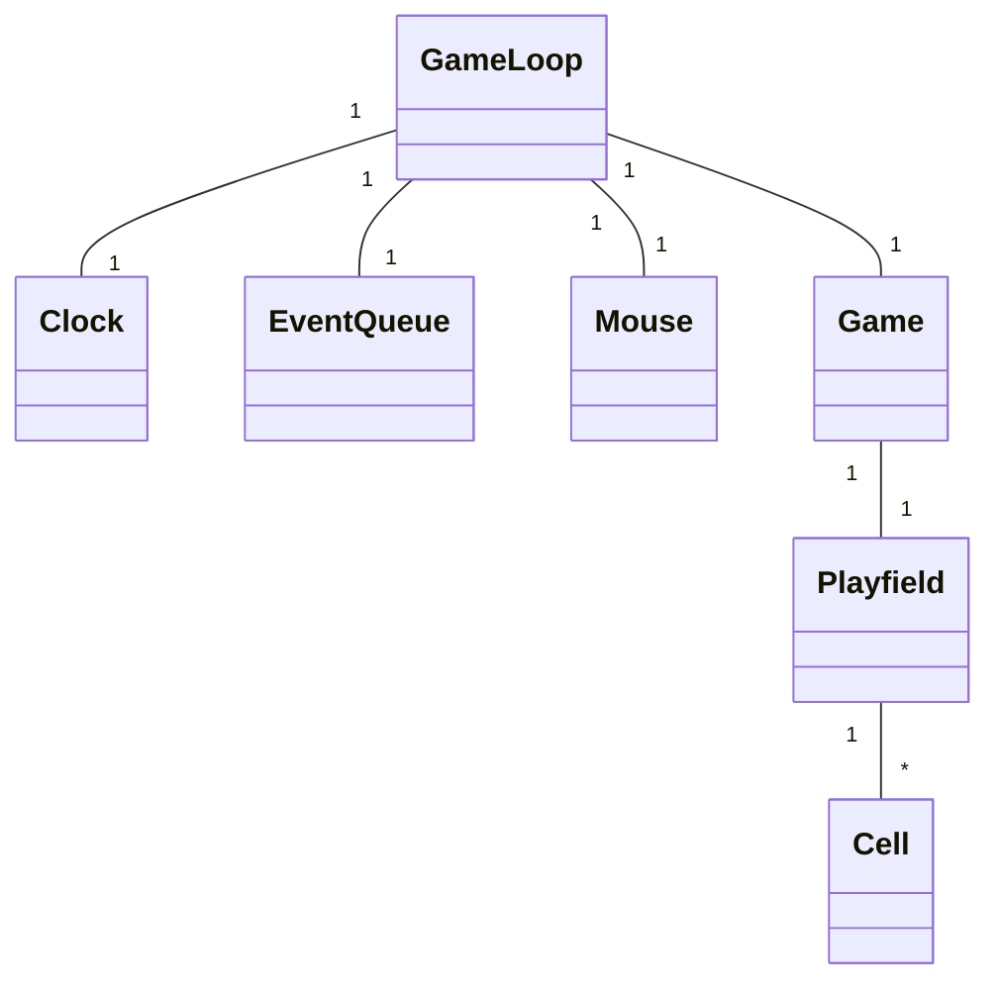
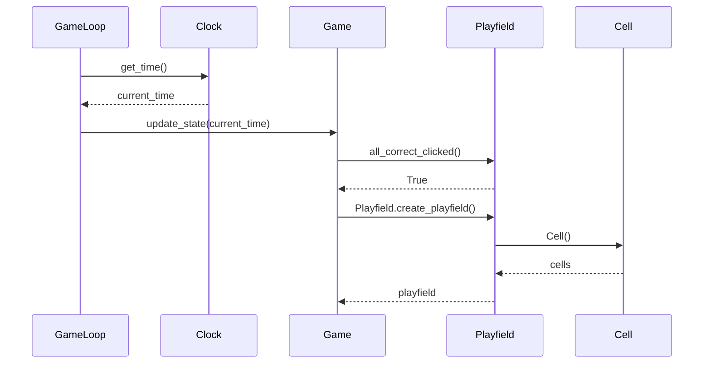

# Arkkitehtuuri

## Rakenne
Ohjelman pakkausrakenne on seuraavanlainen:  
  

Pakkaus __game__ sisältää pelilogiikan ja peliloopin. __UI__:ssa olevat luokat vastaavat pelin ja menujen piirtämisestä sekä käyttäjän syötteiden lukemisesta. __Services__-pakkauksessa on kellopalvelu pelille. __Components__ sisältää pelikentän, ja __sprites__ piirrettävät solut sekä niiden taustat.
 

## Luokkakaavio

      
## Uuden Tason Luominen

