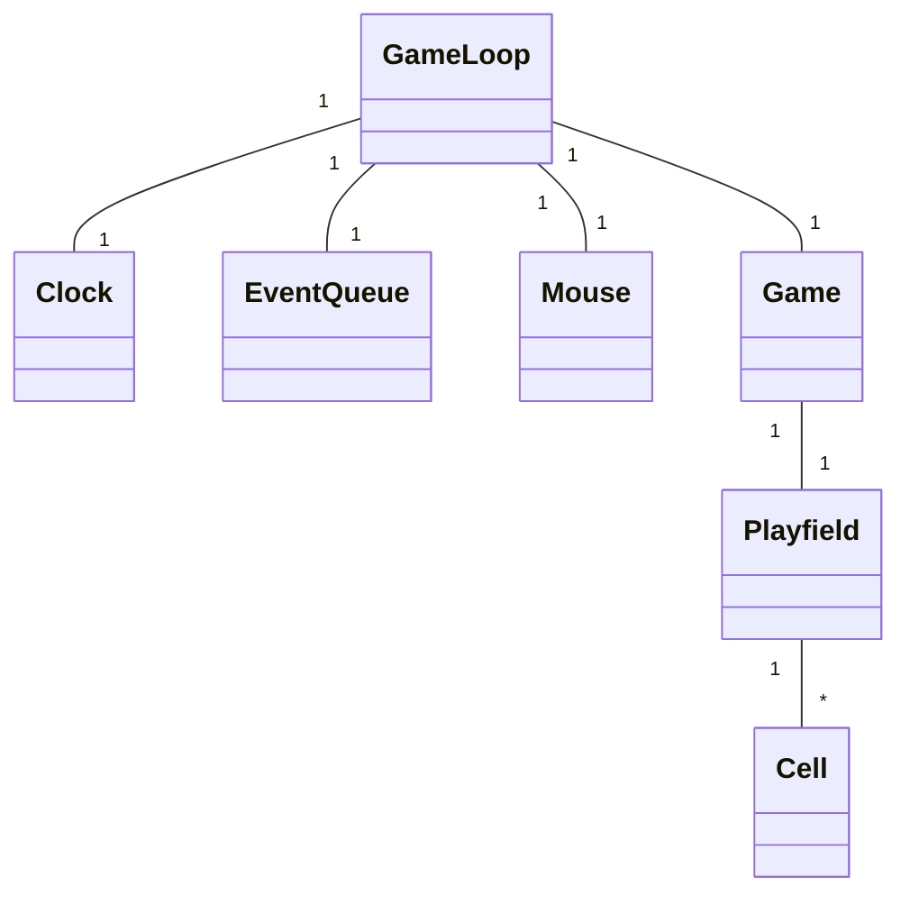
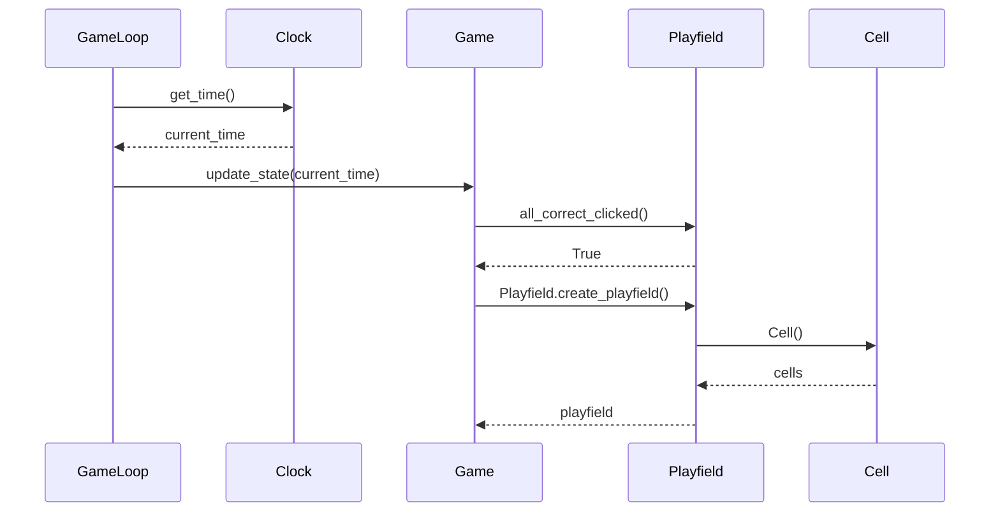

# Arkkitehtuuri

## Luokkakaavio

```mermaid
classDiagram
  GameLoop "1" -- "1" Clock
  GameLoop "1" -- "1" EventQueue
  GameLoop "1" -- "1" Mouse
  GameLoop "1" -- "1" Game
  Game "1" -- "1" Playfield
  Playfield "1" -- "*" Cell
```
      
## Uuden Tason Luominen

```mermaid
sequenceDiagram
  participant GameLoop
  participant Clock
  participant Game
  participant Playfield
  participant Cell
  GameLoop->>Clock: get_time()
  Clock-->>GameLoop: current_time
  GameLoop->>Game: update_state(current_time)
  Game->>Playfield: all_correct_clicked()
  Playfield-->>Game: True
  Game->>Playfield: Playfield.create_playfield()
  Playfield->>Cell: Cell()
  Cell-->>Playfield: cells
  Playfield-->>Game: playfield
```
