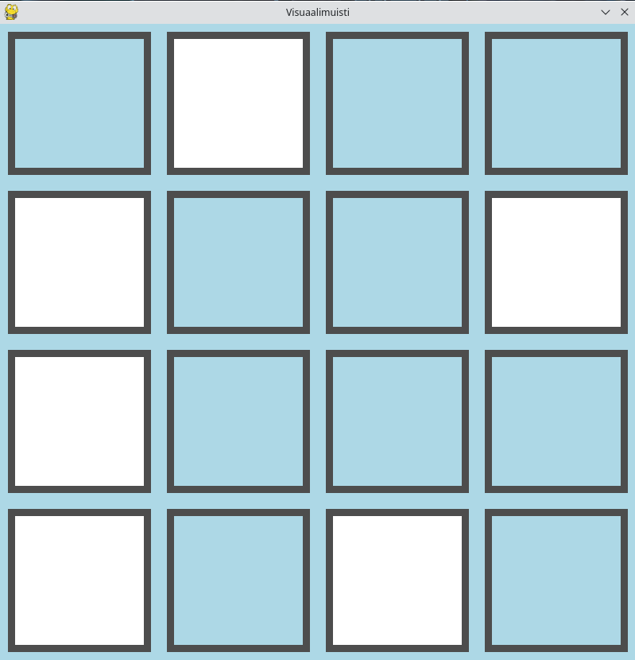
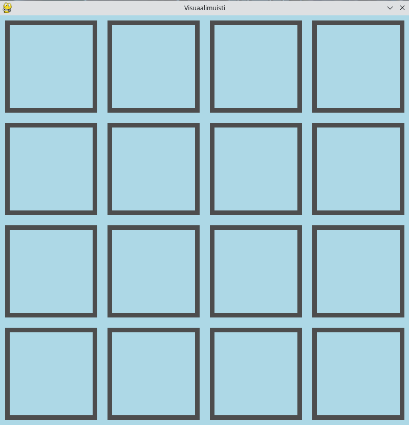
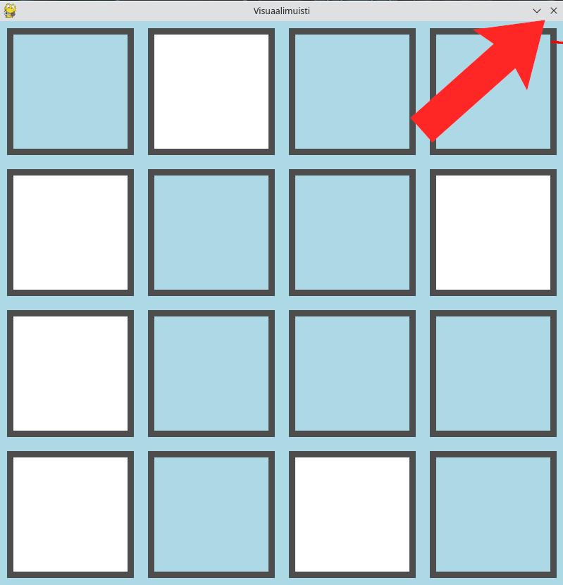

# Käyttöohje

## Pelin käynnistäminen
Pelin voi käynnistää ajamalla komentorivillä komento ```poetry run invoke start```

## Pelin aloittaminen
Pelin voi aloittaa painamalla aloitusnäytön painiketta _Pelaa._  
  


## Pelin pelaaminen
Kun aloitat pelin, näät joukon valkoisia ruutuja. Tehtävänäsi on muistaa valkoisten ruutujen sijainti. 
  


Valkoiset ruudut katoavat hetken kuluttua ja taso näyttää tyhjältä  
  


Klikkaa kaikkia kohtia, joissa muistat valkoisen ruudun olleen. Jos klikkaat kaikki oikein, pääset seuraavalle tasolle, jossa kentän sivujen pituus on yhden suurempi.
Jos taas painat yhtäkin väärää ruutua, menetät elämän, ja voit yrittää saman kokoista tasoa uudelleen. Kun epäonnistut kolme kertaa, peli päättyy.

## Pelin lopettaminen
Pääset takaisin päänäyttöön sekä kesken pelin että game over -näytöstä painamalla oikeassa yläkulmassa olevaa raksia. Peli sulkeutuu painamalla raksia päänäytössä.  



