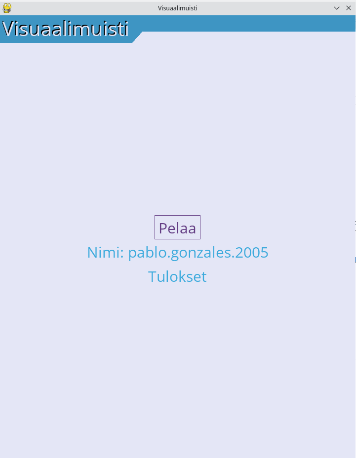

# Käyttöohje

Pelin voi ladata GitHubin releases-osiosta.

## Konfigurointi
Voit halutessasi muuttaa tietokantatiedoston nimeä muutammalla ympäristömuuttujaa juurihakemistossa olevassa tiedostossa ```.env```.

## Pelin asentaminen
Asenna ensin riippuvuudet ajamalla komento ```poetry install``` juurihakemistossa. Alusta sen jälkeen tietokanta ajamalla komento ```poetry run invoke initialize```.

## Pelin käynnistäminen
Pelin voi käynnistää ajamalla komentorivillä komento ```poetry run invoke start```.

## Pelin aloittaminen
Voit valita käyttäjänimen kirjoittamalla sen nimikenttään. Pääset katsomaan tuloksia painamalla _Tulokset_ painiketta. Pelin voi aloittaa painamalla painiketta _Pelaa._ 
  


## Pelin pelaaminen
Kun aloitat pelin, näet joukon valkoisia ruutuja. Tehtävänäsi on muistaa valkoisten ruutujen sijainti. 
  


Valkoiset ruudut katoavat hetken kuluttua ja taso näyttää tyhjältä.
  


Klikkaa kaikkia kohtia, joissa muistat valkoisen ruudun olleen. Jos klikkaat kaikki oikein, pääset seuraavalle tasolle, jossa kentän sivujen pituus on yhden suurempi.
Jos taas painat yhtäkin väärää ruutua, menetät elämän, ja voit yrittää saman kokoista tasoa uudelleen. Kun epäonnistut kolme kertaa, peli päättyy.

## Pelin lopettaminen
Pääset takaisin päänäyttöön kesken pelin painamalla oikeassa yläkulmassa olevaa raksia. Peli sulkeutuu painamalla raksia päänäytössä.  


